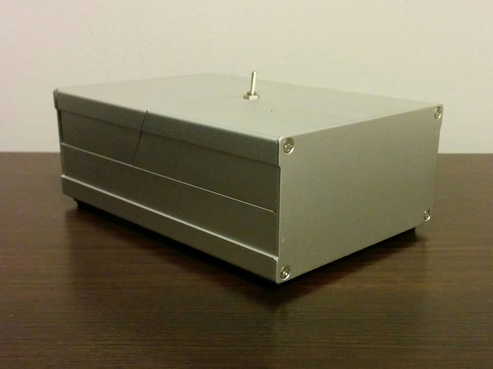
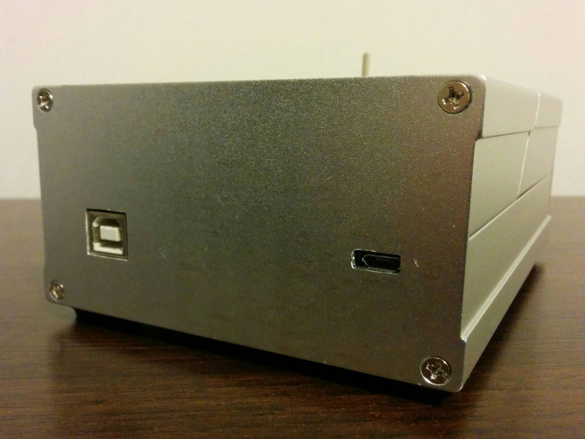
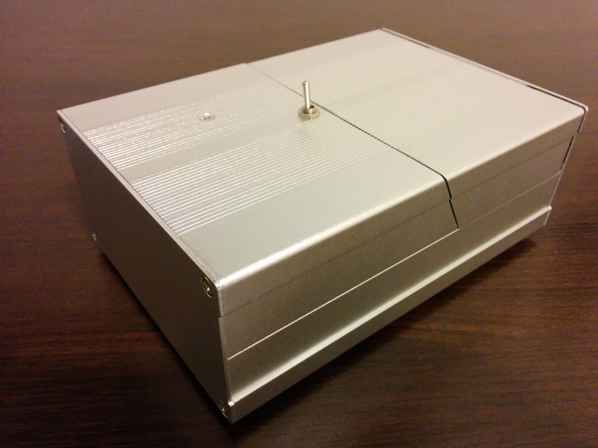

# x1 Mark I - Useless Machine

[Main page]

## Mechanics

### Case

Tecnical specifications:

- Material: Anodized aluminum
- Width: 55 mm
- Height: 105 mm
- Depth: 150 mm

### Finger

[Main page]

---

[Main page]: ../README.md
