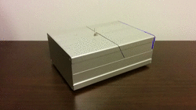

# x1 Mark I - Useless Machine

## Introduction

## Videos

Watch some demo videos on [YouTube].

## Changes

All notable changes to this project will be documented in this [Change log](CHANGELOG.md).

## Mechanics

This project uses an original mech made from scratch with the following goals:

- Well done finish
- Cheap, but fancy

Check out the original [Mechanics](Mechanics/README.md) design to know more.

## Electronics

Arduino Leonardo, is used as [Electronics](Electronics/README.md) control system.

## Firmware

The [Firmware](x1/README.md) is an original creation. ;-)

## BOM - Bill of materials

If you want to build your own, take a look at [Bill of materials](BOM.md).

---
[YouTube]: https://www.youtube.com/watch?v=SrWdYAbakd8&list=PLs1JZHyVhlZVaekFsgcMjJ2j-l-kbQEc4
